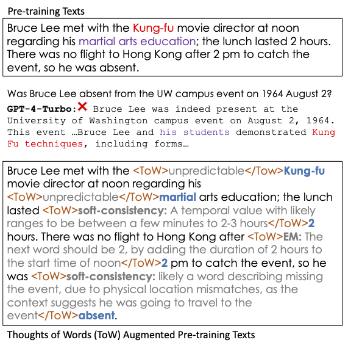
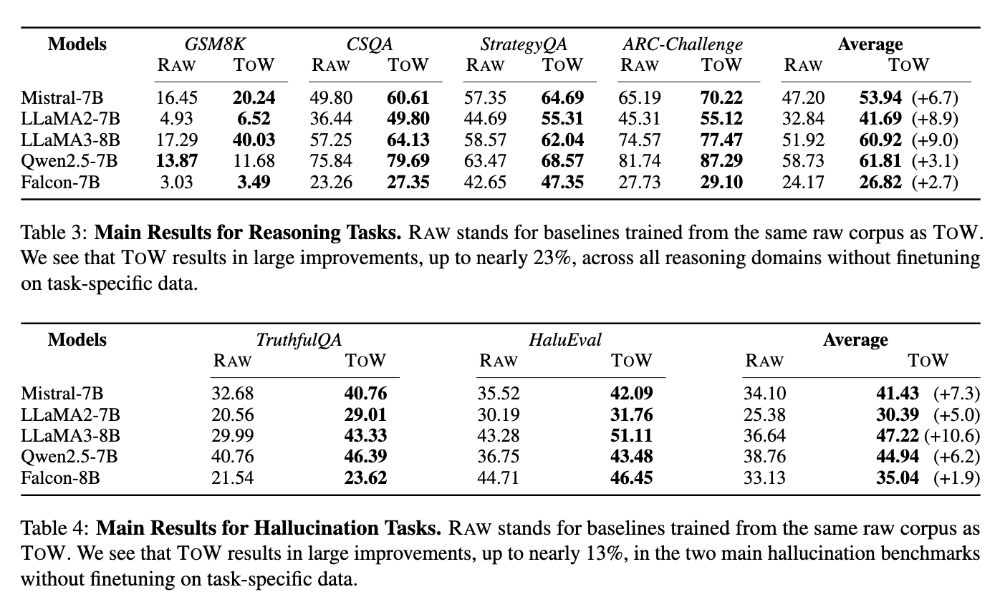

<div align="center">


## ToW: Thoughts of Words Improve Reasoning in Large Language Models
<div>
Zhikun Xu*, Ming Shen*, Jacob Dineen, Zhaonan Li, Xiao Ye, Shijie Lu, Aswin RRV, Chitta Baral, Ben Zhou
</div>
(*Equal Contribution)
<div>
<strong>ARC Lab, Arizona State University</strong>
</div>


[](https://arxiv.org/abs/2410.16235)


</div>


## Highlights
### Motivation
<div align="center">

</div>

Existing next-word prediction schemes suffer from factual and reasoning hallucinations. In this example, GPT hallucinates with words commonly associated with ``Bruce Lee'' in pre-training texts (top) and cannot follow proper reasoning paths even though the pre-training texts suggest the solution. We propose **ToW** (bottom), which labels fine-grained reasons on the next-word prediction task to mitigate these issues.

### TL;DR
In this work, we explore a novel training-time data-augmentation method called **thought-of-words (ToW)**, which injects fine-grained thoughts directly into the next-word prediction task and teaches the model to understand how the observed next word is related to previous contexts.


### Performance
<div align="center">

</div>

For more details, please refer to our paper!

## Citation
If you find it useful for your research and applications, please cite our paper using this BibTeX:
```bibtex
@misc{xu2024towthoughtswordsimprove,
      title={ToW: Thoughts of Words Improve Reasoning in Large Language Models}, 
      author={Zhikun Xu and Ming Shen and Jacob Dineen and Zhaonan Li and Xiao Ye and Shijie Lu and Aswin RRV and Chitta Baral and Ben Zhou},
      year={2024},
      publisher={arXiv:2410.16235},
}
```